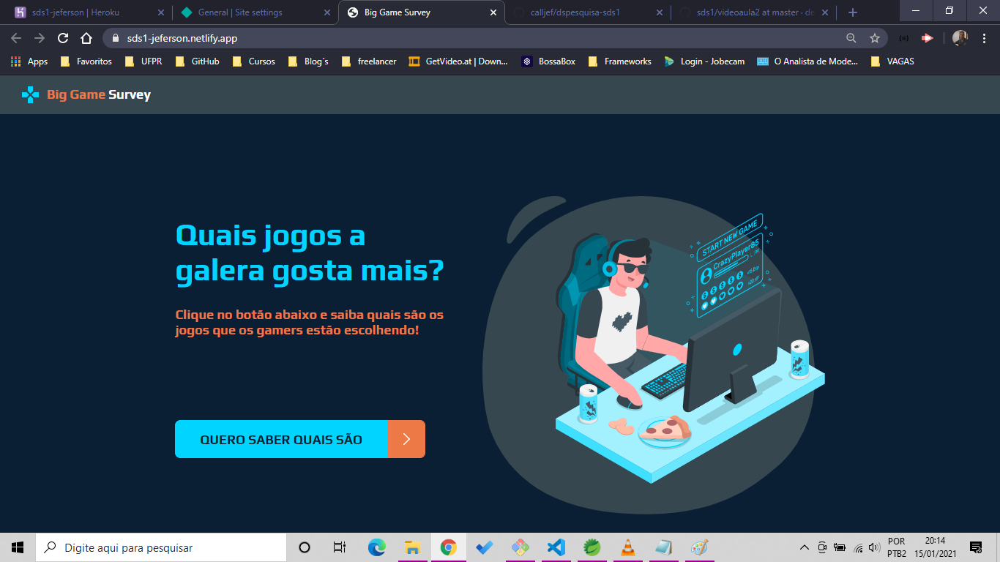
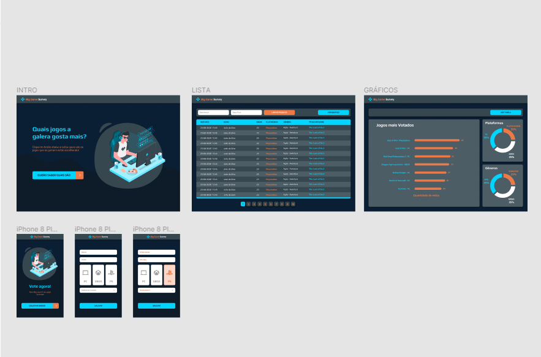
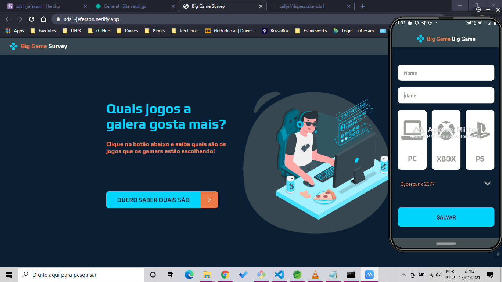
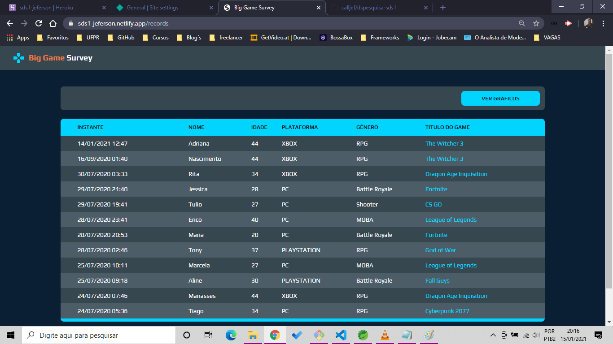

<h1 align="center">
    
</h1>

<h4 align="center"> 
	🚧  BIG GAME SURVEY 🚚 Concluído 🚀 🚧
</h4>

<p align="center">
 <a href="#-sobre-o-projeto">Sobre</a> •
 <a href="#-funcionalidades">Funcionalidades</a> •
 <a href="#-layout">Layout</a> • 
 <a href="#-como-executar-o-projeto">Como executar</a> • 
 <a href="#-tecnologias">Tecnologias</a> • 
 <a href="#-contribuidores">Contribuidores</a> • 
 <a href="#-autor">Autor</a> • 
 <a href="#user-content--licença">Licença</a>
</p>


## 💻 Sobre o projeto 

🚚 BIG GAME SURVEY - é uma plataforma de pesquisa de games por plataforma e com dashboard e tabela de acompanhamento.

Projeto desenvolvido durante a **Semana DEVSuperior1.0** oferecida pela [Semana DevSuperior](https://www.facebook.com/devsuperior.fb).
A Semana DevSuperior  é uma hands-on online com muito conteúdo prático, todo conteúdo fica disponível durante uma semana.

---

## 🚀 Demonstração da aplicação

<a target="_blank" href="https://sds2-jeferson.netlify.app/">
 
  							    						    
</a>

---

## ⚙️ Funcionalidades

- [x] O usuário cadastra no app mobile um game, nome idade e uma plataforma de jogo:

- [x] Na app web é possével ter uma lista na forma de tabela com as informações cadastradas além de gráficos de barra e pizza:

---

## 🎨 Layout

O layout da aplicação

### Figma
<a href="https://www.figma.com/file/AE96dXBqHTLIWI0wU340Px/DSPesquisa?node-id=0%3A1" target="_blank"> 
  <p align="center">
    
  </p>
</a>

### Mobile

<p align="center">
  
</p>

### Web

<p align="center">
  
</p>

---

## 🚀 Como executar o projeto

Este projeto é divido em três partes:
1. Backend (pasta backend) 
2. Frontend (pasta front-web)
3. Mobile (pasta front-mobile)

💡Tanto o Frontend quanto o Mobile precisam que o Backend esteja sendo executado para funcionar.

### Pré-requisitos

Antes de começar, você vai precisar ter instalado em sua máquina as seguintes ferramentas:
[Git](https://git-scm.com), [Java SE Development Kit 11](https://www.oracle.com/br/java/technologies/javase-jdk11-downloads.html), [PostgresSQL](https://www.postgresql.org/)
Além disto é bom ter um editor para trabalhar com o código como [VSCode](https://code.visualstudio.com/)

#### 🎲 Rodando o Backend (servidor)

```bash

# Clone este repositório
$ git clone https://github.com/calljef/dspesquisa-sds1

# Acesse a pasta do projeto no terminal/cmd
$ cd dspesquisa

# Vá para a pasta server
$ cd backend

# Inicialize o Postgres
Windows/Linux/Mac

# Execute a aplicação em modo de test
VS Code / Spring Tools Suite / Eclipse

# O servidor inciará na porta:8080 - acesse http://localhost:8080 

```
<p align="center">
  <a href="https://github.com/tgmarinho/README-ecoleta/blob/master/Insomnia_API_Ecoletajson.json" target="_blank"></a>
</p>


#### 🧭 Rodando a aplicação web (Frontend)

```bash

# Clone este repositório
$ git clone https://github.com/calljef/dspesquisa-sds1

# Acesse a pasta do projeto no seu terminal/cmd
$ cd dsdeliver

# Vá para a pasta da aplicação front-web
$ cd front-web

# Inicialize as dependencias
$ npm install

# Execute a aplicação em modo de dev
$ npm run start

# A aplicação será aberta na porta:3000 - acesse http://localhost:3000

```

---

## 🛠 Tecnologias

As seguintes ferramentas foram usadas na construção do projeto:

#### **Website**  ([React](https://reactjs.org/)  +  [TypeScript](https://www.typescriptlang.org/))

-   **[React Router Dom](https://github.com/ReactTraining/react-router/tree/master/packages/react-router-dom)**
-   **[React Icons](https://react-icons.github.io/react-icons/)**
-   **[Axios](https://github.com/axios/axios)**
-   **[Leaflet](https://react-leaflet.js.org/en/)**
-   **[React Leaflet](https://react-leaflet.js.org/)**

> Veja o arquivo  [package.json](https://github.com/calljef/dspesquisa-sds1/blob/main/front-web/package.json)

#### **Server**  [SPRING FRAMEWORK](https://spring.io/)  
-   **[SPRING DATA](https://spring.io/projects/spring-data)**

#### **Mobile**  ([React Native](http://www.reactnative.com/)  +  [TypeScript](https://www.typescriptlang.org/))

-   **[Expo](https://expo.io/)**
-   **[Expo Google Fonts](https://github.com/expo/google-fonts)**
-   **[React Navigation](https://reactnavigation.org/)**
-   **[React Native Maps](https://github.com/react-native-community/react-native-maps)**
-   **[Expo Constants](https://docs.expo.io/versions/latest/sdk/constants/)**
-   **[React Native SVG](https://github.com/react-native-community/react-native-svg)**
-   **[Axios](https://github.com/axios/axios)**
-   **[Expo Location](https://docs.expo.io/versions/latest/sdk/location/)**
-   **[Expo Mail Composer](https://docs.expo.io/versions/latest/sdk/mail-composer/)**

> Veja o arquivo  [package.json](https://github.com/calljef/dspesquisa-sds1/blob/main/front-mobile/package.json)

#### **Utilitários**

-   Protótipo:  **[Figma](https://www.figma.com/)** 
-   Editor:  **[Visual Studio Code](https://code.visualstudio.com/)**
-   Markdown:  **[StackEdit](https://stackedit.io/)**,  **[Markdown Emoji](https://gist.github.com/rxaviers/7360908)**
-   Teste de API:  **[Insomnia](https://insomnia.rest/)**
-   Ícones:  **[Feather Icons](https://feathericons.com/)**,  **[Font Awesome](https://fontawesome.com/)**
-   Fontes:  **[Ubuntu](https://fonts.google.com/specimen/Ubuntu)**,  **[Roboto](https://fonts.google.com/specimen/Roboto)**


---

## 👨‍💻 Contribuidores

👏 Agradecimento a toda comunidade DevSuprior aos professores [Nelio Alves](https://github.com/acenelio) e [Washington Soares](https://github.com/washingtonsoares)

<table>
  <tr>
    <td align="center"><a href="https://github.com/washingtonsoares"><br /><sub><b>Washington Soares</b></sub></a><br /><a href="https://github.com/washingtonsoares" title="Washington Soares">🚀</a></td>
    <td align="center"><a href="https://github.com/acenelio"><br /><sub><b>Nelio Alves</b></sub></a><br /><a href="https://github.com/acenelio" title="Nelio Alves">🚀</a></td>
  </tr>
</table>

## 💪 Como contribuir para o projeto

1. Faça um **fork** do projeto.
2. Crie uma nova branch com as suas alterações: `git checkout -b my-feature`
3. Salve as alterações e crie uma mensagem de commit contando o que você fez: `git commit -m "feature: My new feature"`
4. Envie as suas alterações: `git push origin my-feature`
> Caso tenha alguma dúvida confira este [guia de como contribuir no GitHub](./CONTRIBUTING.md)

---

## 🦸 Autor

<a href="https://github.com/calljef">
 
 <br />
 <sub><b>Jeferson Nascimento</b></sub></a> <a href="https://github.com/calljef" title="Jeferson Nascimento">🚀</a>
 <br />
 ---

## 📝 Licença

Este projeto esta sobe a licença [MIT](./LICENSE).

Feito com ❤️ por Jeferson Nascimento 👋🏽 [Entre em contato!](https://www.linkedin.com/in/jefersonferreiranascimento/)

---

##  Versões do README

[Português 🇧🇷](./README.md)  |  [Inglês sem emojis 🇺🇸](./README-en.md) | [Portugues sem logo  🇧🇷](./README-sem-logo.md) 


[](https://code.visualstudio.com/)


